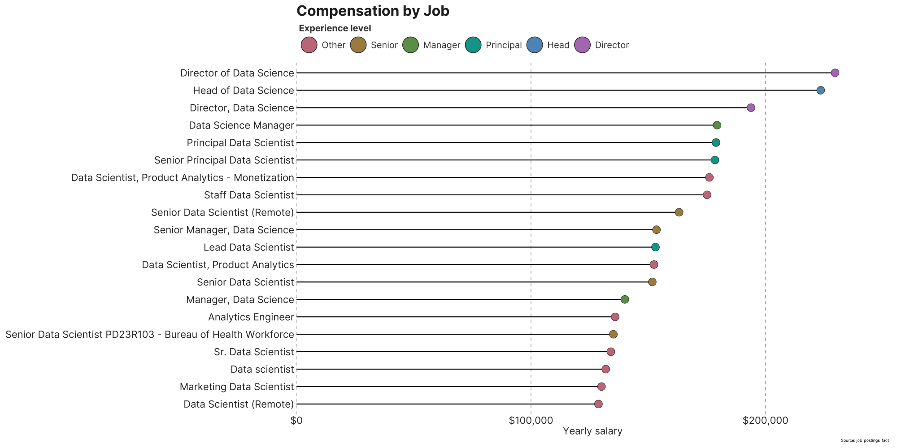

# Compensation by Level


- [Introduction](#introduction)
- [Background](#background)
- [Tools I Used](#tools-i-used)
- [The Analysis](#the-analysis)
  - [1) Top-paying jobs for Data
    Scientists](#1-top-paying-jobs-for-data-scientists)
  - [2. Skills for Top Paying Jobs](#2-skills-for-top-paying-jobs)
  - [3. In-Demand Skills for Data
    Scientists](#3-in-demand-skills-for-data-scientists)
  - [4. Skills Based on Salary](#4-skills-based-on-salary)
  - [5. Most Optimal Skills to Learn](#5-most-optimal-skills-to-learn)
- [What I Learned](#what-i-learned)
- [Conclusions](#conclusions)
- [Closing Thoughts](#closing-thoughts)

# Introduction

📊 This project looks at the data-job market—focusing on **Data
Scientist** roles—and asks a few practical questions: which titles pay
well, which skills show up most often, and which skills seem to align
with higher salaries. The goal is to keep the SQL readable (CTE
pipelines), produce tidy outputs, and pair them with small, reproducible
plots.

🔍 SQL queries? Check them out here: [sql_queries](sql_scripts)  
📊 Data visualization in R? Find here: [R_scripts](R_scripts)

# Background

This is a learning project based on the structure of Luke Barousse’s
*SQL for Data Analytics*. I adapted the ideas to a compact workflow that
I can iterate on later (e.g., switch role filters, change time windows,
or add company/location cuts). Data include job titles, salaries,
locations, and skills extracted from postings.

The questions I try to answer:

1.  What are the **top-paying** jobs for my role?
2.  What **skills** are required for those top-paying jobs?
3.  What are the **most in-demand** skills?
4.  Which skills are **associated with higher pay**?
5.  What are the **“optimal” skills** (a simple balance of demand and
    salary)?

# Tools I Used

- **SQL** — querying, cleaning, joining, aggregating  
- **PostgreSQL** — database engine for the job/skills tables  
- **Visual Studio Code** — editing and running SQL  
- **Git & GitHub** — version control and sharing  
- **R** (tidyverse) — wrangling and plotting from exported tables

------------------------------------------------------------------------

# The Analysis

Each section below mirrors one question. I keep the SQL minimal and the
interpretation brief, with a few caveats where small sample sizes could
skew averages.

## 1) Top-paying jobs for Data Scientists

**Idea.** Filter to Data Scientist roles, bucket titles into simple
seniority levels with a `CASE`, then summarize pay per
`(job_title, level)`. I compute both **mean** and **median** (median is
more robust to outliers) and sort on median for the final table/plot.

``` sql
WITH filtered AS (
  SELECT
    j.job_id,
    j.job_title,
    j.job_title_short,
    j.salary_year_avg
  FROM job_postings_fact j
  WHERE j.salary_year_avg IS NOT NULL
    AND j.job_title_short ILIKE '%Scientist%'
    AND j.salary_year_avg BETWEEN 20000 AND 1000000
),
leveled AS (
  SELECT
    job_title,
    CASE
      WHEN job_title ILIKE '%Director%' THEN 'Director'
      WHEN job_title ILIKE '%Head%'     THEN 'Head'
      WHEN job_title ILIKE '%Lead%' OR job_title ILIKE '%Principal%' THEN 'Principal'
      WHEN job_title ILIKE '%Senior%'   THEN 'Senior'
      WHEN job_title ILIKE '%Manager%'  THEN 'Manager'
      WHEN job_title ILIKE '%Associate%' OR job_title ILIKE '%Mid%'  THEN 'Associate'
      WHEN job_title ILIKE '%Junior%' OR job_title ILIKE '%Entry%'   THEN 'Junior'
      ELSE 'Other'
    END AS level,
    salary_year_avg
  FROM filtered
),
by_title AS (
  SELECT
    job_title,
    level,
    COUNT(*) AS n_postings,
    ROUND(AVG(salary_year_avg),0) AS mean_salary,
    percentile_cont(0.50) WITHIN GROUP (ORDER BY salary_year_avg) AS median_salary
  FROM leveled
  GROUP BY job_title, level
  HAVING COUNT(*) >= 10                    
)
SELECT *
FROM by_title
ORDER BY median_salary DESC;
```

Plot the thing with

``` r
# load libraries ----
library(here)
library(tidyverse)
library(scales)
library(showtext)
library(vroom)


# Add font
font_add_google("Inter", "inter"); showtext_auto()

# Save and plot file  
png(filename=here("figures/01_compensation_by_job.png"),width = 2000,height = 1000)
ggplot(vroom(here("csv/01_table.csv")) %>% 
         slice_max(mean_salary, n = 20, with_ties = FALSE) %>% 
         mutate(level = factor(level, levels = c("Other", "Junior","Associate","Senior","Manager","Principal","Head","Director"))) %>% 
         mutate(job_title = forcats::fct_reorder(job_title, mean_salary, .desc = FALSE)),
       aes(x = mean_salary,
           y = job_title, 
           fill = level)) +
  geom_segment(aes(x = 0, xend = mean_salary, yend = job_title),
               linewidth = 1, color = "black") +
  geom_point(size = 8, shape = 21, color = "black") +
  scale_x_continuous(
    labels = label_dollar(),
    breaks = breaks_pretty(n = 3),
    expand = expansion(mult = c(0,.1))
  ) +
  colorspace::scale_fill_discrete_qualitative(
    palette = "Dark2",
    name = "Experience level"   # legend title (optional)
  ) +
  labs(
    title = "Compensation by Job",
    #subtitle = "Color-coded by job experience",
    x = "Yearly salary",
    y = NULL,
    caption = "Source: job_postings_fact"
  ) +
  guides(
    fill = guide_legend(
      direction = "horizontal", # lay out keys in a row
      nrow = 1,
      byrow = TRUE,
      title.position = "top",
      title.hjust = 0,
      override.aes = list(      # make legend keys look like your points
        shape = 21, size = 16 ,
        colour = "grey20", stroke = 1
      )
    )
  ) +
  theme_minimal(base_family = "inter") +
  theme(
    plot.title      = element_text(face = "bold", size = 32, color = "grey15"),
    plot.subtitle   = element_text(size = 24, color = "grey35"),
    axis.text       = element_text(size = 22, color = "grey20"),
    axis.title.x    = element_text(size = 22, color = "grey20"),
    panel.grid.minor= element_blank(),
    panel.grid.major.y = element_blank(),
    panel.grid.major.x = element_line(linetype = "dashed", linewidth = 0.8, color = "grey70"),
    plot.margin     = margin(12, 18, 12, 12),
    legend.position = "top",         # put legend above the panel
    legend.justification = "left",   # left-align under the title
    legend.box.just = "left",
    legend.box = "horizontal",
    legend.title = element_text(face = "bold", size = 20, colour = "grey25"),
    legend.text  = element_text(size =  20, colour = "grey25"),
    legend.key.width  = unit(20, "pt"),
    legend.key.height = unit(20, "pt"),
    legend.box.margin = margin(0, 0, 0, 0)   # spacing around the legend
  )
dev.off()
```



**Takeaway.** Senior/principal/lead variants dominate the upper salary
bands, as expected. Using a median sort keeps extreme offers from
overwhelming the ranking.

## 2. Skills for Top Paying Jobs

To understand what skills are required for the top-paying jobs, I joined
the job postings with the skills data, providing insights into what
employers value for high-compensation roles. For joining, I needed first
to simplify the previous code to merge the job ids together with the
required skills.

``` sql
WITH filtered AS (
  SELECT
    j.job_id,
    j.job_title,
    j.job_title_short,
    j.salary_year_avg
  FROM job_postings_fact j
  WHERE j.salary_year_avg IS NOT NULL
    AND j.job_title_short ILIKE '%Scientist%'
    AND j.salary_year_avg BETWEEN 20000 AND 1000000
),
leveled AS (
  SELECT
    f.job_title,    
    f.job_id,
    CASE
      WHEN job_title ILIKE '%Director%' THEN 'Director'
      WHEN job_title ILIKE '%Head%'     THEN 'Head'
      WHEN job_title ILIKE '%Lead%' OR job_title ILIKE '%Principal%' THEN 'Principal'
      WHEN job_title ILIKE '%Senior%'   THEN 'Senior'
      WHEN job_title ILIKE '%Manager%'  THEN 'Manager'
      WHEN job_title ILIKE '%Associate%' OR job_title ILIKE '%Mid%'  THEN 'Associate'
      WHEN job_title ILIKE '%Junior%' OR job_title ILIKE '%Entry%'   THEN 'Junior'
      ELSE 'Other'
    END AS level,
    salary_year_avg
  FROM filtered f
  ORDER BY
    salary_year_avg DESC
   LIMIT 20
)
SELECT 
    COUNT(*) AS skills_counter,
    skills
FROM leveled
INNER JOIN skills_job_dim ON leveled.job_id = skills_job_dim.job_id
INNER JOIN skills_dim ON skills_job_dim.skill_id = skills_dim.skill_id
GROUP BY skills
ORDER BY skills_counter DESC
LIMIT 5
```

| Skill  | Counter |
|--------|:--------|
| Python | 14      |
| SQL    | 10      |
| R      | 8       |
| Hadoop | 5       |
| Spark  | 5       |

**Takeaway.** Among the very top offers, Python, SQL, and R are common
co-requirements. Big-data tooling (Hadoop, Spark) also appears, though
this is a small sample (top-20 jobs), so it’s best read as “what often
accompanies the very highest salaries.”

## 3. In-Demand Skills for Data Scientists

This query helped identify the skills most frequently requested in job
postings (independent of the salary), directing focus to areas with high
demand.

``` sql
WITH base AS (
  SELECT j.job_id, s.skills
  FROM job_postings_fact j
  JOIN skills_job_dim sj ON j.job_id = sj.job_id
  JOIN skills_dim      s ON sj.skill_id = s.skill_id
  WHERE j.job_title_short ILIKE '%Data Scientist%'
),
tot AS (
  SELECT COUNT(DISTINCT job_id) AS n_jobs FROM base
)
SELECT
  b.skills,
  COUNT(DISTINCT b.job_id) AS demand_count,
  ROUND( COUNT(DISTINCT b.job_id)::numeric / t.n_jobs * 100, 1 ) AS demand_pct
FROM base b
CROSS JOIN tot t
GROUP BY b.skills, t.n_jobs
ORDER BY demand_count DESC
LIMIT 5;
```

| Skill   | Counter | Percentage |
|---------|:--------|:-----------|
| Python  | 140012  | 78.5       |
| SQL     | 97835   | 54.8       |
| R       | 72526   | 40.7       |
| Tableau | 35472   | 19.9       |
| AWS     | 33779   | 18.9       |

**Takeaway.** Python leads (≈79% of postings), followed by SQL (≈55%)
and R (≈41%). Tableau and AWS still appear meaningfully, hinting that
even Data Scientist roles mix analytics/BI and cloud skills.

## 4. Skills Based on Salary

Exploring the average salaries associated with different skills revealed
which skills are the highest paying.

``` sql
WITH base AS (
  SELECT
    s.skills,
    j.job_id,
    j.salary_year_avg
  FROM skills_dim s
  JOIN skills_job_dim sj ON s.skill_id = sj.skill_id
  JOIN job_postings_fact j ON sj.job_id = j.job_id
  WHERE j.salary_year_avg BETWEEN 20000 AND 1000000
    AND j.job_title_short ILIKE '%Scientist%'
)
SELECT
  skills,
  COUNT(DISTINCT job_id) AS per_group,
  ROUND(AVG(salary_year_avg), 0) AS mean_salary_per_skill
FROM base
GROUP BY skills
HAVING COUNT(DISTINCT job_id) > 10
ORDER BY mean_salary_per_skill DESC;
```

| Skill        | Counter | Mean Salary |
|--------------|:-------:|------------:|
| watson       |   19    |      183460 |
| neo4j        |   44    |      170861 |
| dplyr        |   16    |      163111 |
| slack        |   22    |      162306 |
| dynamodb     |   23    |      160361 |
| notion       |   12    |      159177 |
| airflow      |   241   |      158922 |
| hugging face |   28    |      156812 |
| zoom         |   22    |      155873 |
| rshiny       |   24    |      154712 |
| go           |   460   |      153973 |
| theano       |   32    |      153167 |
| cassandra    |   63    |      153053 |
| express      |   115   |      151281 |
| atlassian    |   33    |      150734 |

**Takeaway.** Several specialized or stack-specific tools are associated
with high mean salaries (e.g., Neo4j, Airflow, Go, Cassandra). Some rows
have small counts (12–30 postings), so treat their averages with
caution; a median column would be a good next iteration.

## 5. Most Optimal Skills to Learn

Combining insights from demand and salary data, this query aimed to
pinpoint skills that are both in high demand and have high salaries,
offering a strategic focus for skill development.

``` sql
SELECT 
    skills_dim.skill_id,
    skills_dim.skills,
    COUNT(skills_job_dim.job_id) AS demand_count,
    ROUND(AVG(job_postings_fact.salary_year_avg), 0) AS avg_salary
FROM job_postings_fact
INNER JOIN skills_job_dim ON job_postings_fact.job_id = skills_job_dim.job_id
INNER JOIN skills_dim ON skills_job_dim.skill_id = skills_dim.skill_id
WHERE
    job_title_short ILIKE  '%Scientist%'
    AND job_title ILIKE  '%Senior%'

    AND salary_year_avg IS NOT NULL
GROUP BY
    skills_dim.skill_id
HAVING
    COUNT(DISTINCT(skills_job_dim.job_id)) > 10
ORDER BY
    avg_salary DESC,
    demand_count DESC
LIMIT 25;
```

| Skill      | Counter | Mean Salary |
|------------|:-------:|:-----------:|
| c#         |   24    |   200920    |
| cassandra  |   14    |   194245    |
| plotly     |   26    |   184813    |
| neo4j      |   13    |   181530    |
| gitlab     |   20    |   179552    |
| matplotlib |   60    |   174541    |
| seaborn    |   27    |   173269    |
| c++        |   60    |   170163    |
| express    |   22    |   169130    |
| go         |   138   |   165974    |
| spark      |   345   |   165668    |
| jupyter    |   54    |   164630    |
| airflow    |   98    |   164354    |
| hadoop     |   163   |   164050    |

**Takeaway.** For Senior roles, a few skills combine strong pay with
meaningful demand—most notably Spark (345 postings), Go (138), Hadoop
(163), and Airflow (98). Higher averages with small counts (e.g., C# at
24 postings) are interesting but may be less stable.

# What I Learned

- CTE pipelines help keep logic readable: filter → enrich → aggregate →
  rank.  
- Joins across fact/dimension tables (including many-to-many
  postings↔skills) are the core of the analysis.  
- Robust summaries: using medians when possible reduces the impact of
  outliers; averages are still useful with a sample-size floor.  
- Ranking and thresholds: window/aggregate patterns and HAVING make
  “top-N” and “min-N” filters straightforward.  
- Plot-ready outputs: producing tidy tables (counts, medians/means)
  makes the R side simple.

# Conclusions

Demand leaders: For Data Scientist roles, Python (78.5%), SQL (54.8%),
and R (40.7%) dominate requirements.  
- High-pay associations: Among skills appearing in ≥10 postings, tools
like Neo4j, Airflow, Go, Cassandra, Matplotlib/Seaborn, and Hadoop are
linked with higher mean salaries.  
- Senior “balance” skills: Considering both pay and demand, Spark, Go,
Hadoop, and Airflow look like good bets for Senior roles.  
- Caveats: Some very high averages come from small samples (e.g., 12–30
postings). A median-based view and larger thresholds would further
stabilize rankings.

# Closing Thoughts

This was a helpful way to practice SQL on a realistic problem. The
queries are easy to retarget (e.g., change role to “Data Engineer,” add
a time window, or slice by location). Next steps I’d like to add: median
salary columns for the skills tables, recency filters, and simple QC
checks (e.g., outlier clipping or IQR rules).
